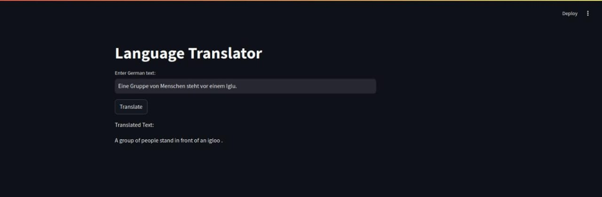

# Language Translator (German to English)

## Overview

This project is a **German-to-English** language translator built using a **Transformer-based sequence-to-sequence model** trained on the **Multi30K dataset**. The application features a **Streamlit-based frontend**, allowing users to input German text and receive translated English output in real-time.

The model was trained and tested in the `translator.ipynb` notebook, and the Streamlit app is launched using `app.py`.

## Demo

  
*Example of the Streamlit web interface*

## Installation

### Prerequisites
- Python 3.8+
- PyTorch
- Streamlit

### Setup and Usage
```bash
# Clone the repository
git clone https://github.com/yourusername/language-translator.git
cd language-translator

# Run the streamlit app
Streamlit run app.py
